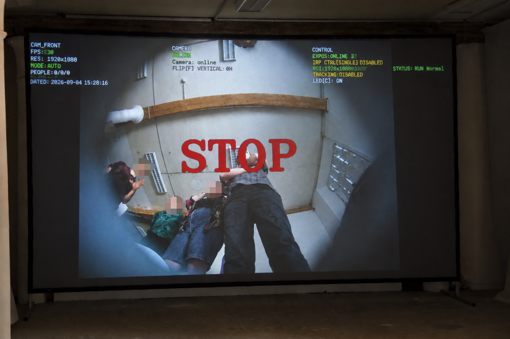

# 面具—悬挂

一个行为表演／交互装置控制程序。面具内部的摄像头由树莓派采集，并通过网络把实时视频串流到主机。主机使用 Java 和 OpenCV 分析面具第一视角中的人物；当识别到有人面向、看向面具时，主机向 ESP32 发送控制命令，由 ESP32 触发起重机，从而开始行为表演。

程序启动后会持续显示画面并进行检测，但默认不向 ESP32 输出控制命令；按 `空格` 后才启用设备控制。




## 工作流程

1. 面具内的摄像头拍摄面具前方。
2. 树莓派将摄像头画面以 MJPEG 视频流发送到主机。
3. 主机识别画面中的人物，并判断是否有人面向／看向面具。
4. 触发条件成立时，主机通过串口向 ESP32 发送命令。
5. ESP32 控制起重机收缩；目标消失或视频中断时停止。

当前程序以人物检测和正脸检测作为“有人看向面具”的触发依据，不进行眼球视线追踪。

## 控制逻辑

- 识别到有人面向／看向面具：发送起重机收缩命令，当前默认为 `DOWN`。
- 未检测到人、视频断流或画面停滞：发送 `STOP`。
- 按住 `↑`／`↓`：手动收缩／放松，优先于自动检测。
- 松开方向键：立即发送 `STOP`，3 秒后恢复自动控制。
- 按 `空格`：启用或禁用 ESP32 输出；禁用时检测和界面仍正常运行。

由于现场接线方向相反，当前默认映射为：收缩 `DOWN`、放松 `UP`。可通过 `HOIST_CONTRACT_COMMAND` 和 `HOIST_DESCEND_COMMAND` 修改。

> 安全说明：程序不包含电子高度闭环或电子限位。实际装置必须具备可靠的物理限位、机械停止和独立急停，并在演出前完成测试。

## 按键

| 按键     | 功能                  |
| -------- | --------------------- |
| `空格` | 启用／禁用 ESP32 控制 |
| `↑`   | 按住时手动收缩        |
| `↓`   | 按住时手动放松        |
| `F`    | 翻转摄像头画面        |
| `D`    | 显示／隐藏调试信息    |
| `ESC`  | 发送`STOP` 并退出   |

## 运行

环境要求：Java 23、Gradle、OpenCV Java。

```bash
gradle run
```

默认读取 `http://192.168.1.98:8080/stream`。使用本机摄像头：

```bash
HELMET_CAMERA_URL="0" gradle run
```

OpenCV 不在默认 Homebrew 路径时：

```bash
OPENCV_JAR="/path/to/opencv.jar" \
OPENCV_LIB_PATH="/path/to/opencv/lib" \
gradle run
```

常用环境变量：

| 变量                       | 默认值                              | 用途                                 |
| -------------------------- | ----------------------------------- | ------------------------------------ |
| `HELMET_CAMERA_URL`      | `http://192.168.1.98:8080/stream` | 摄像头地址；设为`0` 使用本机摄像头 |
| `CONTROLLER_PORT_MATCH`  | 自动匹配常见 USB 串口               | ESP32 串口匹配关键词                 |
| `ESP32_ENABLED_ON_START` | `false`                           | 是否启动后立即启用控制               |
| `HOIST_CONTRACT_COMMAND` | `DOWN`                            | 收缩命令                             |
| `HOIST_DESCEND_COMMAND`  | `UP`                              | 放松命令                             |
| `CAPTURE_ENABLED`        | `false`                           | 是否保存摄像头画面                   |

启用拍摄后，文件保存在 `captures/helmet/`；该目录已被 Git 忽略。

## 摄像头推流

`程序/streamer.py` 可把电脑或树莓派摄像头转换为 MJPEG 流：

```bash
python3 -m pip install flask opencv-python
python3 "程序/streamer.py"
```

默认流地址为 `http://<设备IP>:8000/video`。

## 主要文件

- `程序/HoistSystem.java`：主程序。
- `程序/streamer.py`：MJPEG 摄像头推流脚本。
- `程序/haarcascade_frontalface_alt.xml`：人脸检测兜底模型。
- `build.gradle`：构建和依赖配置。
